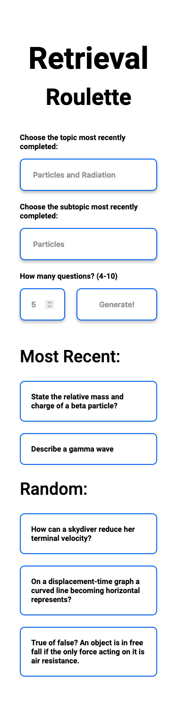

# Retrieval Roulette

## Overview
A site intended to be used as an A-level physics starter and revision resource. The pupil chooses the topic and subtopic they wish to cover and how many questions they want to answer. The site then generates random questions, half from the chosen topic and half from prior topics.

Clicking on a question reveals the answer, clicking again shows the question (think flashcards).

[Live Site](https://ewhite1999.github.io/physics-alevel-retrieval-starter/)

## Screenshot

## Sister-site

There is a simpler version of this site where the pupil can select multiple subtopics to revise from. Here is a [link to the sister-site repo](https://github.com/ewhite1999/physics-alevel-revision-roulette#readme).
